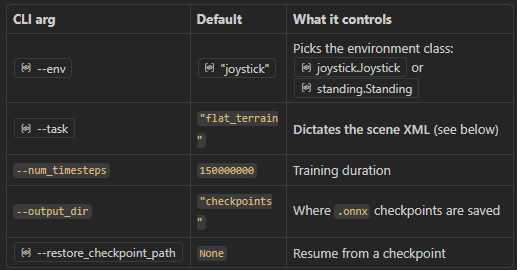

## Initial Setup

### 1. Create Virtual Environment with Python 3.11
The project requires Python 3.10+ (for JAX >=0.5.0 support).

```bash
python3.11 -m venv .venv
```

### 2. Activate the Virtual Environment
```bash
source .venv/bin/activate
```

### 3. Install Requirements
```bash
pip install --upgrade pip
pip install -r requirements.txt
```

This will install:
- JAX with CUDA 12 support
- MuJoCo and MuJoCo MJX  
- TensorFlow, Keras
- Brax, Flax, Optax (RL libraries)
- And all other dependencies

---

## Daily Use

### To activate the venv
```bash
source .venv/bin/activate
```

### To test the ONNX model for waddle robot:
```bash
python -m playground.waddle.mujoco_infer --onnx_model_path ./WADDLE_ALRIGHT_ONNX_340.onnx
```

### To train a new model:
- If on the server use this:
```bash
CUDA_VISIBLE_DEVICES=11 python -m playground.waddle.runner
```
Otherwise:
```bash
python -m playground.waddle.runner
```

### Where files/parameters get changed/located:


### Using the Reference Viewer
```bash
# Basic run with waddle-specific reference data
python -m playground.waddle.ref_motion_viewer \
  --reference_data playground/waddle/data/polynomial_coefficients_MARCH_4.pkl

# Custom velocity command (dx=0.1, dy=0.0, dtheta=0.0 = forward walk)
python -m playground.waddle.ref_motion_viewer \
  --reference_data playground/waddle/data/polynomial_coefficients_3p5cmraise_MARCH_5.pkl \
  --command 0.1 0.0 0.0

# Rough terrain scene
python -m playground.waddle.ref_motion_viewer \
  --reference_data playground/waddle/data/polynomial_coefficients_3p5cmraise_MARCH_5.pkl \
  --scene rough_terrain_NObacklash

# With joystick
python -m playground.waddle.ref_motion_viewer \
  --reference_data playground/waddle/data/polynomial_coefficients_MARCH_4.pkl \
  -joystick
``` 
---

## Notes
- Using Python 3.11 virtual environment (located in `.venv/`)
- Original setup used `uv venv` but switched to standard venv for compatibility
- Requirements include JAX 0.9.1, MuJoCo 3.5.0, TensorFlow 2.20.0